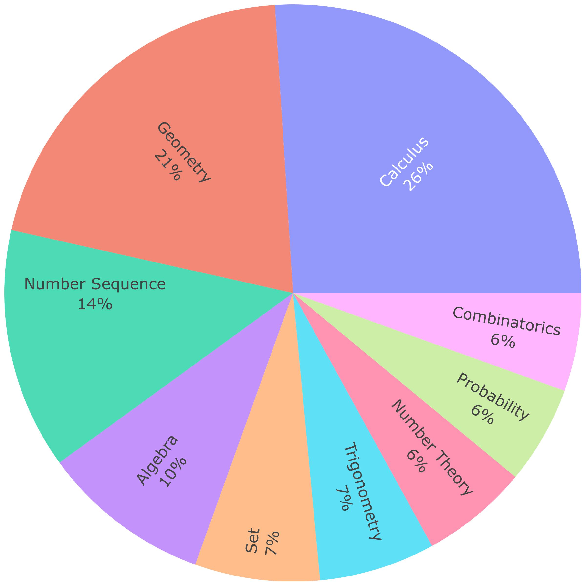

# RFMDataset

## Background
Large reasoning models (e.g., R1, o3) have demonstrated remarkable mathematical problem-solving abilities. However, the high reported accuracy of these advanced models on popular datasets, reliance on purely numerical evaluation and potential benchmark leakage, often masks their true reasoning shortcomings. To address this, we propose leveraging the inherent rigor and methodological complexity of mathematical proofs as a diagnostic tool to expose these hidden failures. Specifically, we introduce the RFMDataset (Reveal Failure Modes), a collection of 200 diverse mathematical proof problems, and thoroughly evaluate advanced models' performance on it. Our in-depth analysis of their failures uncovers 10 fine-grained error types, which shows fundamental limitations in current large reasoning models: 1) large reasoning models grapple profoundly with mathematical proofs, with some generating entirely correct proofs for less than 20\% of problems and failing even on basic ones; 2) models exhibit a diverse spectrum of reasoning failures, prominently demonstrating the lack of guarantees for the correctness and rigor of single-step reasoning; and 3) models show hallucination and incompleteness during the reasoning process. Our findings reveal that models' self-reflection is insufficient to resolve the current logical dilemmas, necessitating formalized and fine-grained logical training.

## RFMDataset
Our dataset contains 200 selected problems from an initial pool exceeding 1000 problems. The problems are stratified by knowledge level, encompassing junior high school (52 problems), senior high school (88 problems), and undergraduate curricula (60 problems). Furthermore, the dataset covers nine distinct mathematical subjects, including but not limited to geometry, trigonometry, number sequence, calculus, and probability. To assess nuanced reasoning capabilities, problems within each knowledge level are assigned one of four ascending difficulty levels (1 to 4) manually.

## Evaluation
Our LLM-as-a-judge method extends beyond holistic proof verification. We've developed a fine-grained error taxonomy comprising over 10 reasoning failure modes, including Logical Violation, Over Generalization, and Circular Reasoning. This enables the precise classification of model-generated proof failures, offering a deeper understanding of their shortcomings.

## Notes
As our dataset contains some original questions, we will mark the sources of the questions in subsequent updates. We welcome everyone to point out the shortcomings in our work and thank all math enthusiasts for their sharing online.
