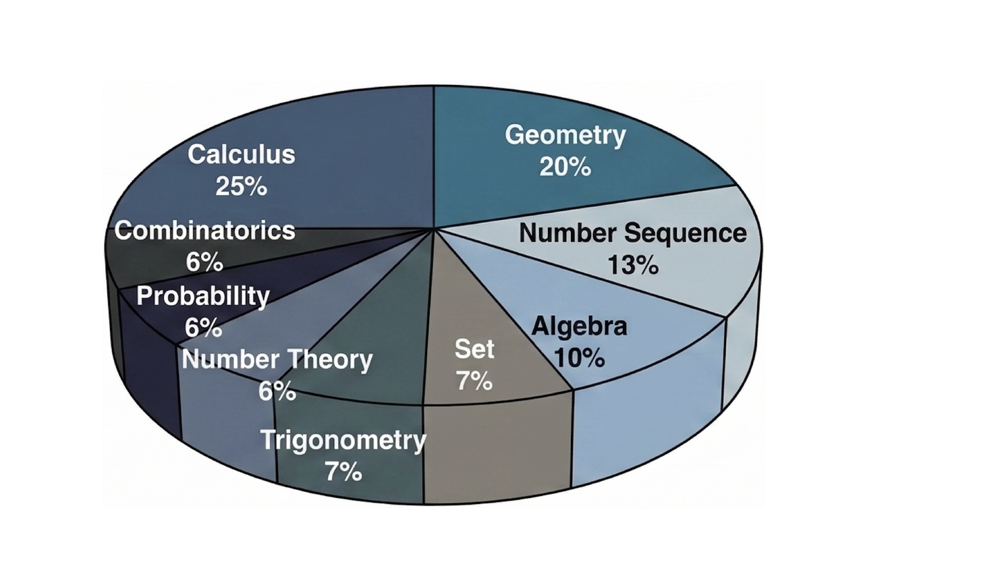
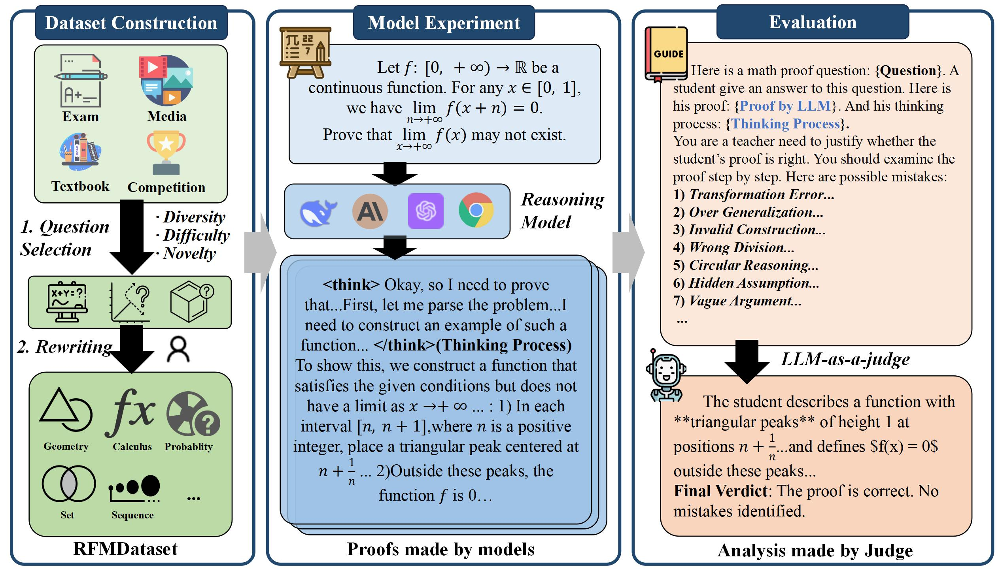
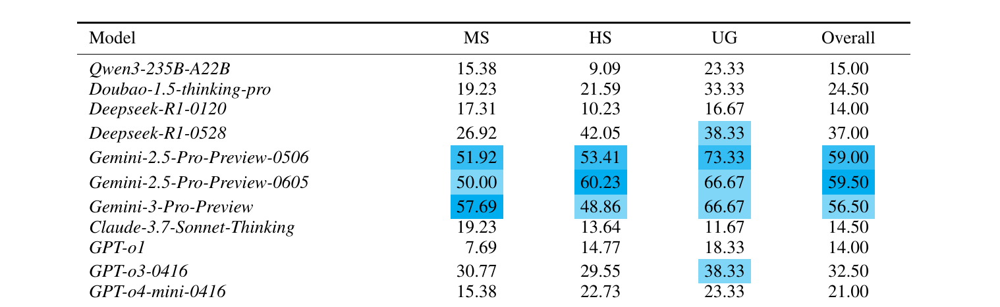
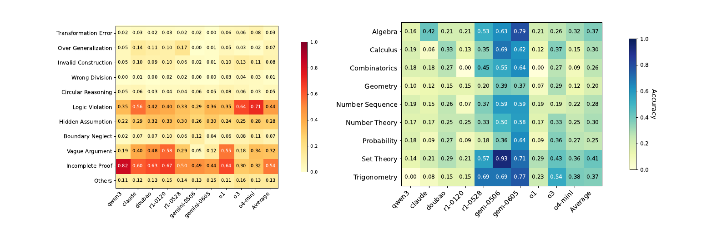
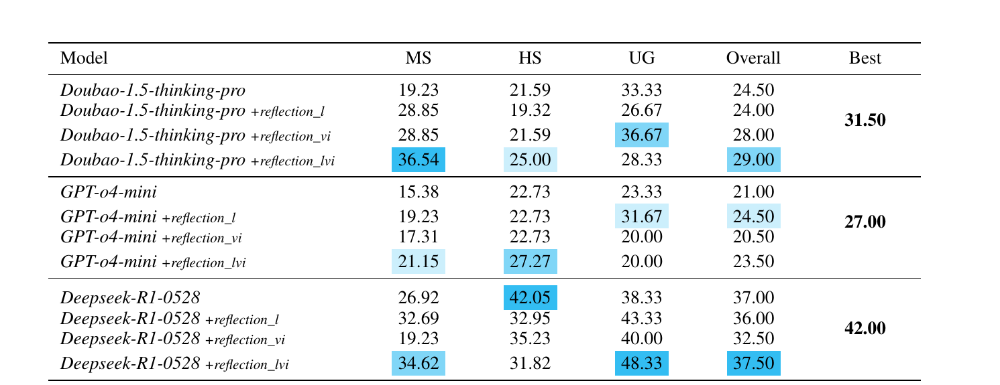

# RFMDataset

RFMDataset (Reveal Failure Modes) is a benchmark for evaluating mathematical proof reasoning in large reasoning models. It contains 200 proof problems, published model answers, LLM-as-a-judge outputs, prompts, and reusable code for loading the data and reproducing the evaluation workflow.

This is the official repository for the paper "Mathematical Proof as a Litmus Test: Revealing Failure Modes of Advanced Large Reasoning Models".

Paper: [arXiv:2506.17114](https://arxiv.org/abs/2506.17114)

## Overview

Large reasoning models (for example, R1 and o3) have shown strong mathematical problem-solving ability on many popular benchmarks. However, aggregate accuracy on numerical-answer datasets can hide deeper issues such as benchmark leakage, incomplete reasoning, hallucinated proof steps, and invalid local deductions.

RFMDataset uses mathematical proofs as a diagnostic setting. The benchmark focuses on fine-grained failure analysis rather than only final-answer correctness. Our evaluation identifies more than 10 reasoning error patterns, including Logic Violation, Over Generalization, Circular Reasoning, Hidden Assumption, Vague Argument, and Incomplete Proof.

The failure-mode taxonomy used by the judge is summarized below:

<table align="center">
  <thead>
    <tr>
      <th>Category</th>
      <th>Definition</th>
      <th>Illustrative Example</th>
    </tr>
  </thead>
  <tbody>
    <tr>
      <td>Transformation Error</td>
      <td>Recasting the target statement into a non-equivalent or strictly weaker one, so a proof no longer addresses the real goal.</td>
      <td>To show a series <code>sum a_n</code> converges, proving only <code>lim_{n-&gt;infty} a_n = 0</code>; or replacing <code>A &lt;=&gt; B</code> with the easier <code>A =&gt; B</code>.</td>
    </tr>
    <tr>
      <td>Over Generalization</td>
      <td>Drawing a universal conclusion from only a few special cases or situations.</td>
      <td>Verifying the claim for <code>n = 1, 3, 5</code> and then declaring it true for all positive integers.</td>
    </tr>
    <tr>
      <td>Invalid Construction</td>
      <td>Presenting an object that either cannot exist under the stated conditions or fails the required properties.</td>
      <td>Claiming a function is everywhere linear yet nowhere differentiable; or defining <code>f(x) = 1/x</code> on all real numbers without addressing <code>x = 0</code>.</td>
    </tr>
    <tr>
      <td>Wrong Division</td>
      <td>Partitioning into cases that miss at least one legitimate possibility or overlap each other.</td>
      <td>For a function's behavior, dividing cases as always positive, always zero, and always negative.</td>
    </tr>
    <tr>
      <td>Circular Reasoning</td>
      <td>Using the desired conclusion, or an equivalent reformulation, as an explicit or hidden premise.</td>
      <td>To prove <code>A =&gt; B</code>, using premises that implicitly assume <code>B</code>.</td>
    </tr>
    <tr>
      <td>Logic Violation</td>
      <td>A single deduction step contradicts logical or algebraic rules.</td>
      <td>From <code>a &lt; b</code> and <code>c &lt; d</code>, concluding <code>a - c &lt; b - d</code>, which is false when <code>c</code> and <code>d</code> are negative.</td>
    </tr>
    <tr>
      <td>Hidden Assumption</td>
      <td>Applying theorems or operations whose hypotheses have not been established or stated.</td>
      <td>Differentiating a function known only to be continuous; or interchanging a limit and an integral without proving uniform convergence.</td>
    </tr>
    <tr>
      <td>Boundary Neglect</td>
      <td>Ignoring edge cases, endpoints, or limiting situations so the proof works only in the middle.</td>
      <td>Declaring <code>f(x) = sqrt(x)</code> differentiable on <code>[0, 1]</code> without checking <code>x = 0</code>.</td>
    </tr>
    <tr>
      <td>Vague Argument</td>
      <td>Relying on intuition, diagrams, or the word obvious rather than rigorous justification.</td>
      <td>Claiming a series obviously converges because the terms get smaller, or that a diagram makes two segments equal.</td>
    </tr>
    <tr>
      <td>Incomplete Proof</td>
      <td>Omitting an essential component in a proof, or providing an unfinished proof.</td>
      <td>Proving sufficiency but not necessity; or writing an induction hypothesis without showing how <code>P(k)</code> implies <code>P(k + 1)</code>.</td>
    </tr>
    <tr>
      <td>Others</td>
      <td>Any error type not covered by the categories above.</td>
      <td>-</td>
    </tr>
  </tbody>
</table>

## Dataset

RFMDataset contains 200 selected proof problems from an initial pool of more than 1000 problems. The released problems are stratified by knowledge level:

<table align="center">
  <thead>
    <tr>
      <th>Level</th>
      <th>Count</th>
    </tr>
  </thead>
  <tbody>
    <tr>
      <td>Junior high school (<code>ms</code>)</td>
      <td align="right">52</td>
    </tr>
    <tr>
      <td>Senior high school (<code>hs</code>)</td>
      <td align="right">88</td>
    </tr>
    <tr>
      <td>Undergraduate (<code>ug</code>)</td>
      <td align="right">60</td>
    </tr>
  </tbody>
</table>

The dataset covers nine mathematical subjects, including geometry, trigonometry, number sequence, calculus, probability, algebra, set theory, number theory, and combinatorics. Each problem is manually assigned one of four difficulty levels.

<p align="center">
  
</p>

## Evaluation

The evaluation method uses an LLM-as-a-judge prompt that goes beyond holistic proof verification. For each proof, the judge produces a binary label for each error pattern and an overall correctness label.

<p align="center">
  
</p>

The expected judgement block has the following structure:

```markdown
### Error Pattern Analysis
- Transformation Error: 1|0
- Over Generalization: 1|0
- Invalid Construction: 1|0
- Wrong Division: 1|0
- Circular Reasoning: 1|0
- Logic Violation: 1|0
- Hidden Assumption: 1|0
- Boundary Neglect: 1|0
- Vague Argument: 1|0
- Incomplete Proof: 1|0
- Others: 1|0

### Overall Correctness
- 1|0
```

## Experimental Results

The main evaluation shows that even advanced reasoning models still struggle with proof generation in RFMDataset. The highlighted cells indicate the strongest results within each column.

<p align="center">
  
</p>

The failure-mode analysis shows that models frequently suffer from logical violations, incomplete proofs, vague arguments, and hidden assumptions. The right heatmap reports model accuracy across mathematical domains.

<p align="center">
  
</p>

We also evaluate model-specific self-reflection prompts. Reflection can improve selected models on some subsets, but the gains are not uniform across models or difficulty levels.

<p align="center">
  
</p>

## Repository Contents

<table align="center">
  <thead>
    <tr>
      <th>Path</th>
      <th>Description</th>
    </tr>
  </thead>
  <tbody>
    <tr>
      <td><code>data/</code></td>
      <td>The 200 proof problems grouped by knowledge level.</td>
    </tr>
    <tr>
      <td><code>answers/</code></td>
      <td>Published model answers used in the evaluation.</td>
    </tr>
    <tr>
      <td><code>judgements/</code></td>
      <td>Published LLM-as-a-judge outputs.</td>
    </tr>
    <tr>
      <td><code>prompt/</code></td>
      <td>Prompts used for proof evaluation and refinement.</td>
    </tr>
    <tr>
      <td><code>images/</code></td>
      <td>Figures used in this README and the paper.</td>
    </tr>
    <tr>
      <td><code>rfmdataset/</code></td>
      <td>Reusable Python package for loading data, parsing judgements, and running evaluation.</td>
    </tr>
    <tr>
      <td><code>scripts/</code></td>
      <td>Command-line helpers built on top of <code>rfmdataset</code>.</td>
    </tr>
    <tr>
      <td><code>tests/</code></td>
      <td>Lightweight tests for data loading and evaluation parsing.</td>
    </tr>
  </tbody>
</table>

## Installation

Use Python 3.10 or newer.

```bash
python -m venv .venv
source .venv/bin/activate
pip install -r requirements.txt
```

On Windows PowerShell:

```powershell
python -m venv .venv
.\.venv\Scripts\Activate.ps1
pip install -r requirements.txt
```

For development checks:

```bash
pip install -r requirements-dev.txt
python -m unittest discover -s tests
```

## Quick Start

Print dataset statistics:

```bash
python scripts/summarize_dataset.py
```

Compute accuracy from an existing judgement file:

```bash
python scripts/summarize_judgements.py judgements/o1_gemini-2.5-pro-preview-0506_all.json
```

Parse a LaTeX source file whose problems are written as `\section*{Question ...}` blocks:

```bash
python scripts/parse_latex.py raw.tex -o problems.json
```

## Running LLM-as-a-Judge Evaluation

The evaluation code calls OpenAI-compatible chat-completion APIs. The repository intentionally does not provide API keys, vendor presets, or default endpoint URLs. Users must provide both the API key and the base URL.

Set the default environment variables:

```bash
export RFM_MODEL_API_KEY=...
export RFM_MODEL_BASE_URL=https://your-model-endpoint.example/v1
export RFM_JUDGE_API_KEY=...
export RFM_JUDGE_BASE_URL=https://your-judge-endpoint.example/v1
```

Then run evaluation on a published answer file:

```bash
python scripts/run_evaluation.py \
  --model your-model \
  --judge-model your-judge \
  --answers-dir answers \
  --output-dir outputs/judgements
```

If you prefer different environment variable names, pass them explicitly:

```bash
export MY_MODEL_KEY=...
export MY_MODEL_URL=https://your-model-endpoint.example/v1
export MY_JUDGE_KEY=...
export MY_JUDGE_URL=https://your-judge-endpoint.example/v1

python scripts/run_evaluation.py \
  --model your-model \
  --judge-model your-judge \
  --model-api-key-env MY_MODEL_KEY \
  --model-base-url-env MY_MODEL_URL \
  --judge-api-key-env MY_JUDGE_KEY \
  --judge-base-url-env MY_JUDGE_URL
```

Generated files are written under `outputs/` by default and are ignored by Git.

## Python Usage

```python
from rfmdataset import __version__
from rfmdataset.data import load_problems
from rfmdataset.summary import dataset_summary, judgement_accuracy

problems = load_problems("data")
print(dataset_summary("data"))
print(judgement_accuracy("judgements/o1_gemini-2.5-pro-preview-0506_all.json"))
```

## Notes

Some problems are original. We will continue to mark and refine problem sources in subsequent updates. We welcome feedback and issue reports.

## Citation

If you use RFMDataset in your research, please cite:

```bibtex
@inproceedings{guo2026mathematical,
  title={Mathematical proof as a litmus test: Revealing failure modes of advanced large reasoning models},
  author={Guo, Dadi and Liu, Jiayu and Fan, Zhiyuan and He, Zhitao and Li, Haoran and Li, Yuxin and Wang, Yumeng and Fung, Yi R},
  booktitle={Proceedings of the 64th Annual Meeting of the Association for Computational Linguistics (Volume 1: Long Papers)},
  pages={12764--12804},
  year={2026}
}
```

## License

This repository is released under the MIT License. See [LICENSE](LICENSE).
